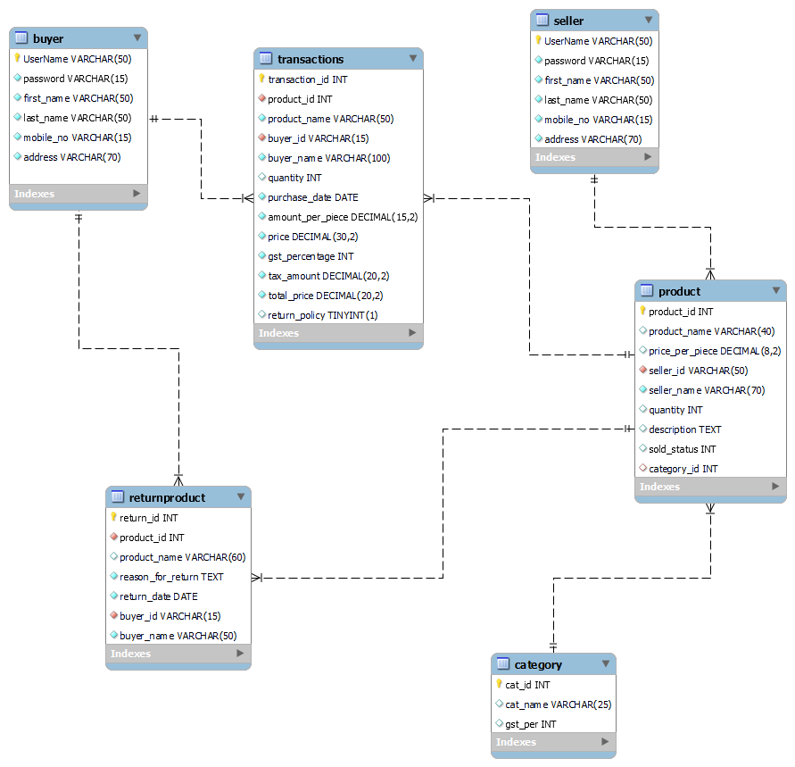
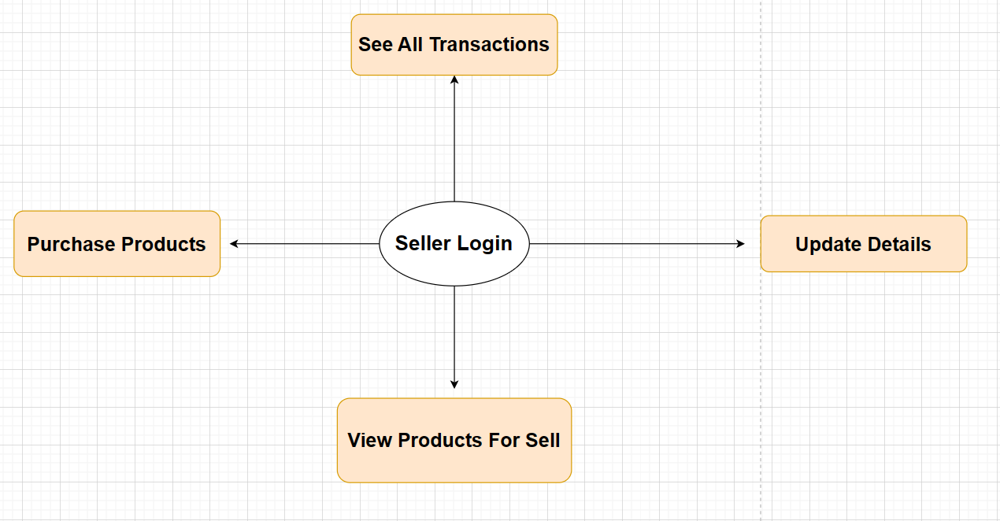
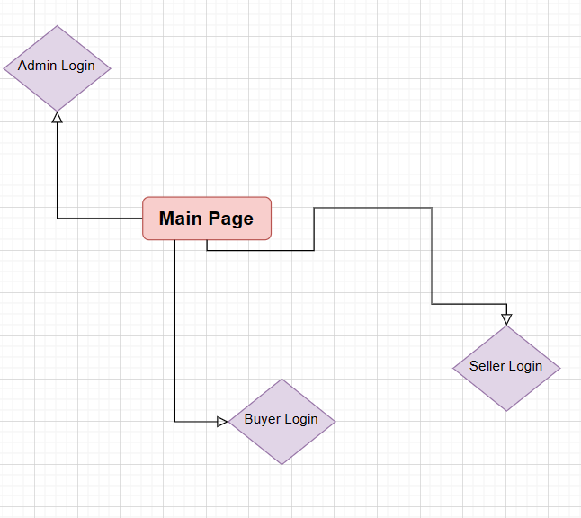
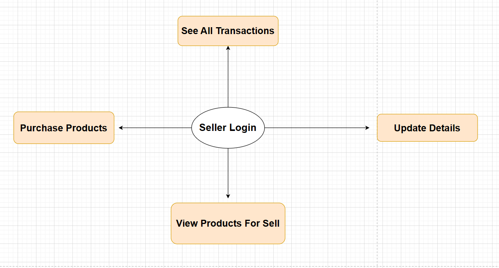
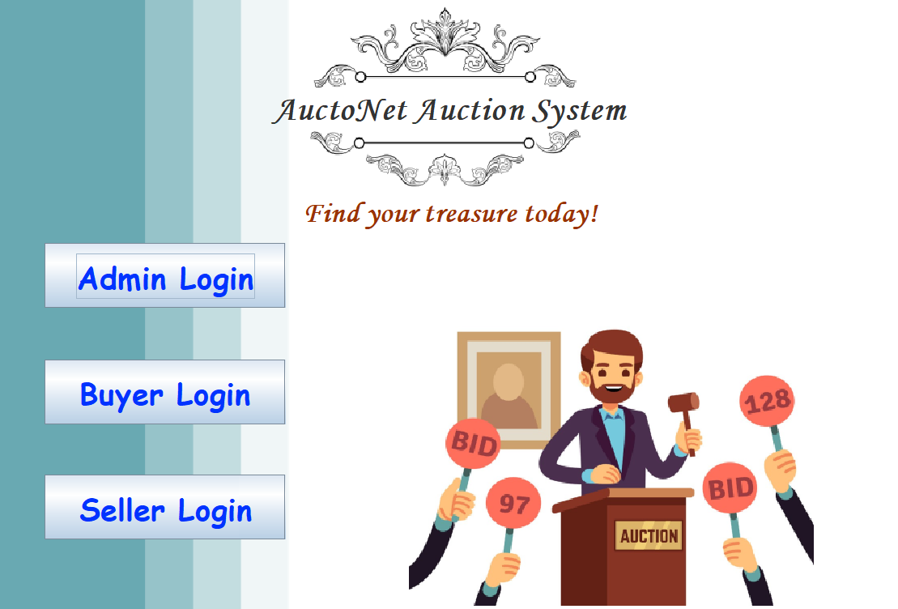
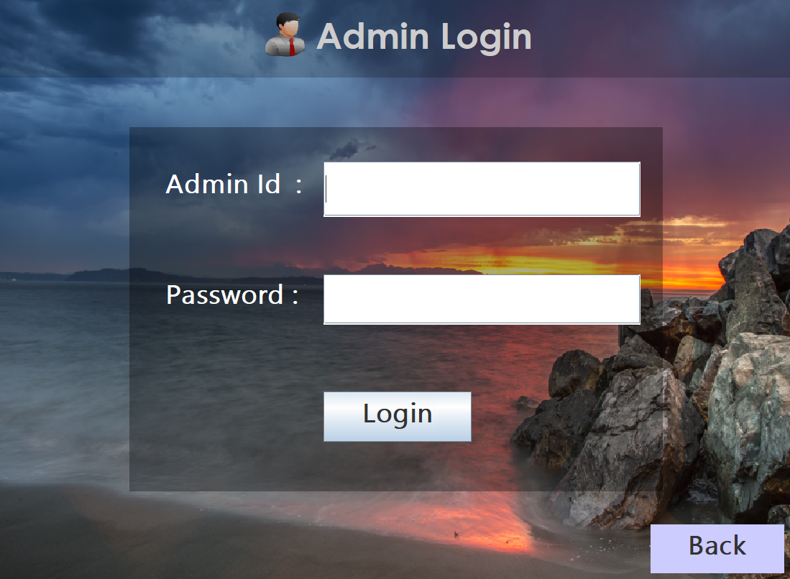
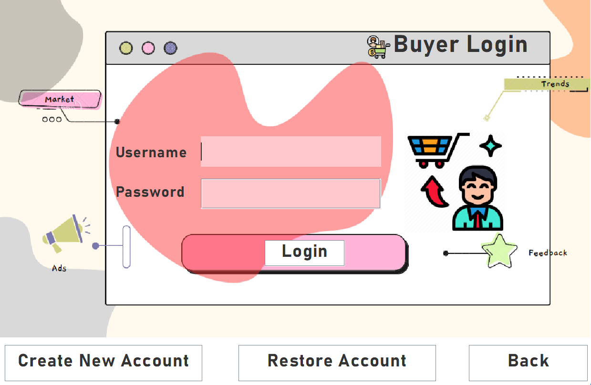
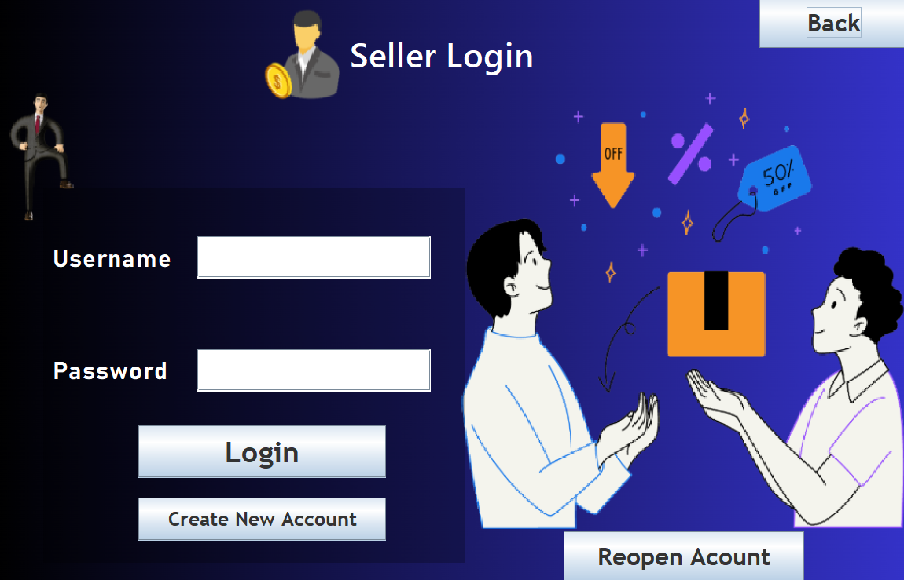

 <h1 align="center">AuctoNet Auction System</h1> 
 

<div align="center">
  
</div>
<h2 align="center">🌟 Embrace the Thrill of Auction Sales 🌟</h2>


<br>
<br>
Welcome to Shopzilla, the cutting-edge automated application software for seamless buying and selling. Our platform connects registered buyers and sellers, revolutionizing the online shopping experience. Sellers can easily list their products, set prices, and manage inventory. Buyers enjoy a wide range of products and competitive prices. Our platform administrators ensure data integrity and maintain a secure environment. With Shopzilla, buyers and sellers can transact directly without the need for customer support. Join us today and discover the convenience of our streamlined online marketplace.


Following are the lists of various users of the system and also the role of the users

## Users of the System
1. Administrator
2. User (can buy and sell)

## ER Diagram
Check out the visual representation of our system's entities and relationships:



:star: Don't forget to show your support by starring this project on GitHub!

## Flow Charts
Explore the flow of operations within the system through our comprehensive flow charts:





## Admin Features 📋

✨ **Login & Logout:** Seamlessly access the system through a secure login process and log out when finished.

✨ **View All Users:** Get an overview of all registered users within the system, including their details.

✨ **View Items to be Sold:** Access a comprehensive list of items available for sale.

✨ **View Items Already Sold:** Check the history of items that have been successfully sold.

✨ **View Items by Category:** Browse items categorized based on different categories such as Clothing, Electronics, Grocery, and Miscellaneous.

✨ **View All Transactions:** Gain insights into all transactions that have taken place within the system.

✨ **View Transactions for a Date Range:** Filter and view transactions that occurred within a specific date range.

✨ **View Transaction by Transaction ID:** Retrieve transaction details using a unique transaction ID.

✨ **View Refunded Products for a Date Range:** Get information about refunded products within a specific date range.


## User Features 📋

✨ **Login with Account:** Conveniently access the system by entering your username and password.

✨ **User Registration:** New users can register by providing their username, first name, last name, address, mobile number, and password.

✨ **Update Personal Details:** Users have the flexibility to update their personal information as needed.

✨ **Change Password:** Easily modify the account password for enhanced security.

✨ **Add Item for Sale:** List items to be sold by providing essential details such as item ID, name, price, quantity, description, sold status (0 for unsold, 1 for sold), and category.

✨ **See All Items Available for Sale:** Browse through a comprehensive list of items currently available for purchase.

✨ **Purchase an Item:** Place bids and purchase desired items (excluding those listed by the user).

✨ **Return Purchased Goods:** Initiate return requests for purchased items within a 5-day window.

✨ **Transaction History:** Access detailed transaction history, including records of purchased, sold, and returned items.


## Main Gui 👨🏻‍💻



## Admin Gui 🛠️



## Buyer Gui 💱📦



## Seller Gui 💰



## Tools Used 🛠️
<table align="center">
  
  <tr>
      <td align="center" width="100">
        
      <br>My SQL
    </td>
    
 <td align="center" width="100">
        
      <br>JDBC
    </td> 
    
<td align="center" width="100">
        
      <br>SpringBoot
    </td>
    
<td align="center" width="100">
        
      <br>Java 
    </td>
    
<td align="center" width="100">
        
      <br>GitHub
    </td> 
 <td align="center" width="100">
        
      <br>Swing
    </td>    
  </tr> 
  </table>


<br>


## Contributing 💡

Thank you for considering contributing to the AuctoNet Auction System! We welcome your participation and value your input. To ensure a smooth and collaborative process, please follow the guidelines below:

1. **Clone the Repository**: Start by cloning this repository to your local machine using the following command:

   ```
   git clone https://github.com/Shubh2-0/AuctoNet-Auction-System.git
   ```

2. **Switch to the Desired Branch**: 📅🌱 The repository contains multiple branches representing different days of the week when development work was done previously. Choose the branch that corresponds to the day of the week. You can switch to a branch using the following command:

   ```
   git checkout branch-name
   ```

   Branches for each day of the week are as follows:
   - `main`
   - `day-1`
   - `day-2`
   - `day-3`
   - `day-4`
   - `day-5`

3. **Build and Test**: 🚀🔬 Before making any changes, build and test the existing codebase to ensure it is functioning correctly. Refer to the project's documentation for instructions on building and running the system.

4. **Create a New Branch**: 🌟🌿 If you want to enhance the code for better performance or add new features, feel free to create a new branch using a descriptive name that reflects the nature of your changes. For example:

   ```
   git checkout -b feature/new-feature
   ```

5. **Implement Your Changes**: 💻🔨 Make your desired changes to the codebase, following the project's coding conventions and best practices.

6. **Commit and Push**: ✅📝 Once you have completed your changes, commit your work with a clear and concise commit message. Then, push your branch to the remote repository:

   ```
   git commit -m "Add new feature: Feature description"
   git push origin feature/new-feature
   ```

7. **Create a Pull Request**: 🔄📬 Go to the GitHub repository and create a new pull request. Select the appropriate branches for comparison and provide a detailed description of your changes, along with any relevant information that would assist with the review process.

8. **Collaborate and Iterate**: 🤝💡 Engage in constructive discussions and address any feedback or suggestions from the community and maintainers. Iterate on your changes as necessary to meet the project's standards.

9. **Merge and Celebrate**: 🎉🔀 Once your pull request is approved and passes all necessary tests, it will be merged into the main branch. Congratulations on your successful contribution!

Thank you for your interest in improving the AuctoNet Auction System. Your contributions will make a significant impact on enhancing the overall user experience! Feel free to create a new branch and let's work together to create something amazing! ✨🚀


<h2>📬 Contact</h2>

If you want to contact me, you can reach me through below handles.


&nbsp;&nbsp;<a href="https://www.linkedin.com/in/shubham-bhati-787319213/"></img></a>

